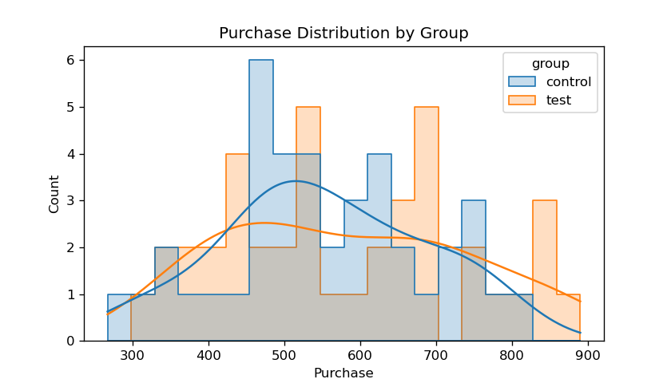
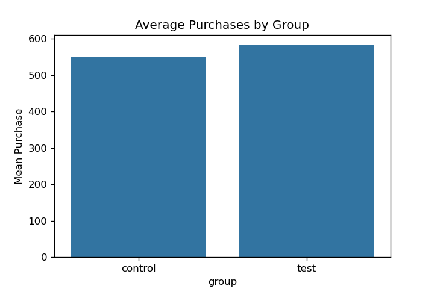

# A/B Test Analysis: Comparing Bidding Strategies (Maximum vs. Average)

**Author:** Halis Karaveli  
**Date:** 2025

---

## Project Overview

This project analyzes the impact of two digital marketing bidding strategies—**Maximum Bidding** and **Average Bidding**—on purchase conversion rates using A/B testing and modern statistical methods.  
The analysis uses **simulated e-commerce data** to demonstrate a complete and reproducible statistical workflow:
- Data preparation
- Assumption checks
- Parametric/non-parametric hypothesis testing
- Visualization
- Data-driven recommendations

> **Disclaimer:**  
> This repository is inspired by an educational exercise from the MIUUL Data Science Bootcamp.  
> All code, analysis, and documentation are original, written by Halis Karaveli, and provided for portfolio and demonstration purposes only.  
> **No proprietary or paid data is included**. If you need a dataset, you may simulate similar features or request access from the original provider.

---

## Business Problem

A retail client is evaluating a new bidding strategy ("Average Bidding") introduced alongside the existing "Maximum Bidding" method.  
The goal is to determine if the new strategy leads to **statistically significant improvements** in purchase conversion rates.

---

## Dataset

- **impression**: Number of ad impressions  
- **Click**: Number of ad clicks  
- **Purchase**: Number of purchases following ad clicks  
- **Earning**: Revenue earned from purchases  

*The sample data in this repository is simulated for demonstration.  
No original or proprietary data is distributed here.*

---

## Methods

- Data exploration and visualization (Seaborn & Matplotlib)
- Independent two-sample t-test and Mann–Whitney U test
- Assumption checks (Shapiro–Wilk for normality, Levene’s test for variance homogeneity)
- KPI visualization
- Data-driven, practical recommendations

---

## Example Results & Visualizations

**1. Distribution of Purchases per Group:**  


**2. Average Purchases by Group:**  


**3. Statistical Test Results:**  

| Metric           | Control Group | Test Group |
|------------------|--------------|------------|
| Purchase Mean    |   550.89     |  582.11    |
| t-test p-value   |    0.349     |            |

*No statistically significant difference was found between bidding strategies (p = 0.349).*

---

## Usage

1. Clone the repository.
2. Place your data in the `datasets/` directory or use the simulated sample data (default behavior if file not found).
3. Run:
    ```bash
    python ab_test_analysis.py
    ```

*All output figures will be saved under the `figures/` directory.*

---

## Citation

If you use this code or approach, please cite or reference the MIUUL Data Science Bootcamp and your own customizations as needed.

---

## Author

Halis Karaveli, 2025

---
